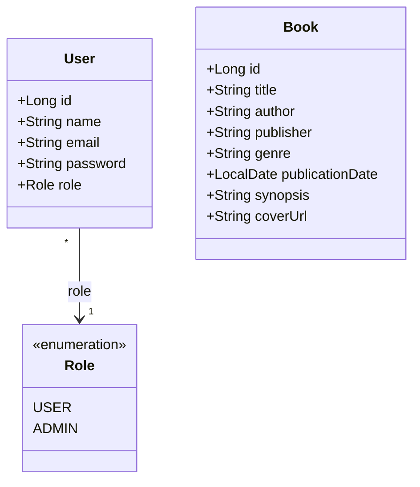

# Xopxe — Camadas da Arquitetura

Documento de referência da organização do projeto: quais são as camadas, o que
mora em cada diretório e como uma requisição atravessa o sistema.

## 1. Visão geral

O Xopxe é um acervo de livros dividido em duas aplicações independentes:

| Aplicação | Tecnologia | Porta | Papel |
|---|---|---|---|
| `backend/` | Java 25 + Spring Boot 4.1 | 8080 | API REST, regras de negócio, acesso ao banco |
| `frontend/` | React 19 + Vite | 5173 | Interface do usuário (SPA) |
| banco | PostgreSQL 17 (contêiner) | 5432 | Persistência |

A camada de apresentação é um **front-end separado** em React, e não templates
Thymeleaf renderizados pelo servidor. Os dois lados conversam apenas por HTTP,
trocando JSON. A consequência prática é que o back-end não devolve HTML em
nenhum endpoint: ele é uma API pura.

```
Navegador
   │  HTTP + JSON
   ▼
React (Vite, :5173)  ──►  Spring Boot (:8080)  ──►  PostgreSQL (:5432)
```

## 2. Camadas do back-end

O código é organizado **por funcionalidade** (`auth`, `book`, `user`), e dentro
de cada pacote ficam as classes das várias camadas. A alternativa seria agrupar
por camada (`controllers/`, `services/`, `entities/`); optamos por agrupar por
funcionalidade porque mantém junto tudo que muda pelo mesmo motivo — mexer em
"livro" abre um diretório só.

```
backend/src/main/
├── java/br/com/dominadores/xopxe/
│   ├── XopxeApplication.java        ponto de entrada (@SpringBootApplication)
│   │
│   ├── book/                        funcionalidade: acervo
│   │   ├── Book.java                Entidade JPA  ── camada de modelo
│   │   ├── BookRepository.java      Repositório   ── camada de persistência
│   │   ├── BookService.java         Serviço       ── camada de negócio
│   │   ├── BookController.java      Controlador   ── camada de apresentação
│   │   └── BookDtos.java            DTOs de entrada e saída
│   │
│   ├── user/                        funcionalidade: usuários
│   │   ├── User.java                Entidade JPA
│   │   ├── Role.java                enum USER / ADMIN
│   │   ├── UserRepository.java      Repositório
│   │   └── DatabaseUserDetailsService.java   ponte com o Spring Security
│   │
│   ├── auth/                        funcionalidade: login e cadastro
│   │   ├── AuthController.java      Controlador
│   │   └── AuthDtos.java            DTOs
│   │
│   └── config/                      configuração transversal
│       ├── SecurityConfig.java      regras de acesso, CORS, BCrypt
│       ├── ApiExceptionHandler.java tradução de exceções em JSON
│       └── DemoUsersSeeder.java     usuários de teste na 1ª execução
│
└── resources/
    ├── application.yaml             banco, Flyway, CORS, formato de erro
    └── db/migration/                Flyway — o schema versionado
        ├── V1__create_users_table.sql
        └── V2__create_books_table.sql
```

### 2.1 Models / Entities (JPA)

`Book` e `User` são classes anotadas com `@Entity`, e cada uma corresponde a
uma tabela. São elas que definem o formato dos dados no resto do sistema.

```java
@Entity
@Table(name = "books")
public class Book {
    @Id @GeneratedValue(strategy = GenerationType.IDENTITY)
    private Long id;

    @Column(nullable = false)
    private String title;
    // ...
}
```

Dois pontos que valem ser explicados:

**O Flyway é o dono do schema, não o Hibernate.** O `application.yaml` usa
`ddl-auto: validate`: o Hibernate *confere* se as entidades batem com as
tabelas e falha na inicialização se não baterem, mas nunca cria nem altera
coluna. Quem cria as tabelas são os arquivos em `db/migration/`, aplicados em
ordem pelo Flyway. Assim o banco de cada integrante do grupo evolui igual, e a
alteração de schema fica versionada no Git junto do código.

**A entidade nunca sai da API.** A senha do `User` é um campo da entidade, e
serializá-la direto no JSON vazaria o hash. Por isso existem os DTOs.

### 2.2 DTOs — a fronteira da API

`AuthDtos` e `BookDtos` guardam `record`s que representam exatamente o que
entra e o que sai de cada endpoint:

- **Entrada** (`RegisterRequest`, `CreateBookRequest`): validados com Bean
  Validation (`@NotBlank`, `@Email`, `@Size`, `@PastOrPresent`). O
  `@Valid` no controlador faz o Spring rejeitar o corpo inválido antes de
  qualquer código nosso rodar.
- **Saída** (`UserResponse`, `BookResponse`): montados a partir da entidade por
  um método estático `from(...)`. `UserResponse` simplesmente não tem campo de
  senha — o vazamento fica impossível por construção, não por disciplina.

### 2.3 Repositories

Interfaces que estendem `JpaRepository<Entidade, TipoDoId>`. Não têm
implementação: o Spring Data gera a classe concreta em tempo de execução e
deriva a consulta SQL a partir do **nome do método**.

```java
public interface UserRepository extends JpaRepository<User, Long> {
    Optional<User> findByEmail(String email);   // select * from users where email = ?
    boolean existsByEmail(String email);        // select count(*) > 0 ...
}
```

Herdamos de graça `save`, `findById`, `findAll`, `deleteById` e a paginação.

### 2.4 Services

Camada de regra de negócio, entre o controlador e o repositório. `BookService`
existe para que o `BookController` não converse com o `BookRepository`
diretamente: o controlador cuida de HTTP, o serviço cuida da regra.

> **Estado atual:** `BookService` é um esqueleto — os três métodos lançam
> `UnsupportedOperationException`. Os endpoints de livro respondem, portanto,
> HTTP 500 até que a implementação seja feita. O cadastro e o catálogo da
> interface ainda usam dados de exemplo (`frontend/src/data/books-mock.js`).
> O fluxo de autenticação, esse sim, está completo e funcionando.

### 2.5 Controllers

Classes `@RestController` que expõem as rotas HTTP. Cada método traduz uma
requisição em uma chamada de serviço e devolve um DTO, que o Spring serializa
em JSON.

| Método | Rota | Acesso | Faz |
|---|---|---|---|
| POST | `/api/auth/register` | público | cria conta, devolve `UserResponse` (201) |
| POST | `/api/auth/login` | público | valida credenciais, devolve `UserResponse` |
| GET | `/api/books` | público | lista o acervo, com `?q=` e `?genre=` |
| GET | `/api/books/{id}` | público | detalha uma obra |
| POST | `/api/books` | **ADMIN** | cadastra uma obra (201) |

### 2.6 Configuração transversal

**`SecurityConfig`** concentra três decisões:

1. **Quem pode o quê** — login, cadastro e leitura do acervo são públicos;
   `POST /api/books` exige o papel `ADMIN`; qualquer outra rota exige estar
   autenticado.
2. **CORS** — o navegador só deixa o front em `localhost:5173` chamar
   `localhost:8080` se o servidor autorizar explicitamente essa origem. A
   origem permitida vem do `application.yaml`.
3. **Senhas** — o bean `PasswordEncoder` é um `BCryptPasswordEncoder`. Nenhuma
   senha é guardada em texto puro.

O CSRF está desabilitado porque o front é uma SPA separada que ainda não envia
token CSRF. É uma simplificação consciente de projeto de faculdade, não um
descuido.

**`ApiExceptionHandler`** é um `@RestControllerAdvice`: converte
`ResponseStatusException` em um corpo enxuto `{"message": "..."}`, que é o que
o front sabe exibir.

**`DatabaseUserDetailsService`** é a ponte entre o nosso `User` e o Spring
Security: dado um e-mail, devolve um `UserDetails` com o hash da senha e o
papel no formato que o framework espera (`ROLE_ADMIN`, `ROLE_USER`).

## 3. Camadas do front-end

O front é uma SPA em React, construída com Vite, escrita em JSX + CSS puro —
sem biblioteca de componentes nem de estilo.

```
frontend/src/
├── main.jsx               ponto de entrada: monta o React e carrega o CSS global
├── App.jsx                casca da aplicação e troca de página
│
├── pages/                 uma tela inteira, junta os componentes e guarda o estado
│   ├── MainPage.jsx       acervo: busca + filtros + catálogo + detalhe
│   └── BookRegistration.jsx  formulário de cadastro de obra
│
├── components/            peças reutilizáveis, só .jsx
│   ├── Header.jsx         cabeçalho: título, data e navegação
│   ├── SearchBar.jsx      campo de busca
│   ├── Filters.jsx        os cinco filtros
│   ├── BooksCatalog.jsx   lista de obras
│   ├── BooksInfo.jsx      painel de detalhes da obra selecionada
│   ├── DefaultInfo.jsx    painel exibido quando nada está selecionado
│   ├── BookForm.jsx       formulário da obra
│   ├── AccountMenu.jsx    menu de conta (login / cadastro / sair)
│   └── index.js           reexporta tudo: import { X } from "../components"
│
├── api/                   acesso ao back-end
│   └── auth.js            login() e register()
│
├── data/                  dados de exemplo enquanto a API de livros não existe
│   ├── books-mock.js
│   └── filter-options.js
│
├── styles/                todo o CSS, separado do JSX
│   ├── tokens.css         variáveis de cor e fonte (:root)
│   ├── base.css           reset e estilo dos elementos base
│   ├── panel.css          .panel — caixa usada por vários componentes
│   ├── App.css            estilos da casca
│   └── <Componente>.css   um arquivo por componente ou página
│
└── assets/                imagens
```

### 3.1 Organização do CSS

Cada arquivo de estilo tem o nome do componente ou da página a que pertence, e
é importado por ele:

```jsx
// components/SearchBar.jsx
import "../styles/SearchBar.css";
```

Três arquivos fogem dessa regra por serem globais e são carregados uma única
vez no `main.jsx`:

- `tokens.css` — a paleta e as fontes, como variáveis CSS. Trocar a cor do
  projeto inteiro é editar uma linha aqui.
- `base.css` — o reset e o estilo dos elementos (`body`, `h1`, `img`, ...).
- `panel.css` — a classe `.panel`, compartilhada por `BooksInfo`,
  `DefaultInfo` e `AccountMenu`.

Os nomes de classe seguem a convenção **BEM** (`bloco__elemento--modificador`,
como `.book-card__title` e `.book-card--selected`). Como o CSS aqui é global,
é o prefixo do bloco que garante que dois componentes não colidam.

### 3.2 Estado e fluxo de dados

Não há Redux nem Context: o estado mora no componente-pai mais próximo que
precisa dele, e desce por props.

- `App` guarda a página atual e o usuário logado. Entrega as duas coisas ao
  `Header`: o usuário, que ele repassa ao `AccountMenu`, e a página atual mais
  o `onNavigate`, que os botões do menu usam para trocar de tela.
- `MainPage` guarda o termo de busca, os filtros e a obra selecionada, calcula
  a lista visível e a entrega pronta ao `BooksCatalog`.
- `AccountMenu` guarda o formulário de login e avisa o `App` por callback
  (`onLogin`) quando a autenticação dá certo.

Os componentes de `components/` são, em sua maioria, **de apresentação**:
recebem dados e callbacks por props e não buscam nada sozinhos. A exceção é o
`AccountMenu`, que chama `api/auth.js` diretamente.

## 4. Diagrama de classes

As duas entidades do banco, com o enum do papel do usuário. Cada classe
corresponde a uma tabela criada pelas migrações do Flyway.



| Classe | Tabela | Observações |
|---|---|---|
| `User` | `users` | `email` é único; `password` guarda o hash BCrypt; `role` é gravado como texto (`USER` / `ADMIN`) |
| `Book` | `books` | `cover_url` é o único campo opcional; há índice por `genre` |

`User` e `Book` ainda não se relacionam: o acervo não registra quem cadastrou a
obra, e a tabela de avaliações — que ligaria as duas — ainda não existe.

## 5. O caminho de uma requisição

Cadastro de um novo usuário, do clique ao banco:

1. **`AccountMenu.jsx`** — o usuário abre o menu de conta no `Header`,
   preenche nome, e-mail e senha e envia o formulário. O componente chama
   `register(...)`.
2. **`api/auth.js`** — monta o `fetch` `POST /api/auth/register` com o corpo em
   JSON. Se o servidor não responder, lança um erro em português que o
   componente exibe.
3. **CORS + Spring Security** — a requisição passa pela cadeia de filtros. A
   origem `localhost:5173` está liberada e a rota é pública, então segue.
4. **`AuthController.register`** — o `@Valid` roda o Bean Validation sobre o
   `RegisterRequest`. Se o e-mail já existe, lança `ResponseStatusException`
   com 409.
5. **`PasswordEncoder`** — a senha vira um hash BCrypt.
6. **`UserRepository.save`** — o Spring Data traduz a chamada em `INSERT` e o
   Hibernate a executa contra a tabela `users`.
7. **`UserResponse.from(user)`** — a entidade é convertida no DTO de saída, sem
   o campo de senha, e volta como JSON com status 201.
8. Um erro no caminho seria capturado pelo **`ApiExceptionHandler`** e chegaria
   ao front como `{"message": "..."}`, que o `AccountMenu` mostra ao usuário.

## 6. Como rodar

O script `dev.sh` na raiz sobe o banco, o back-end e o front-end:

```bash
./dev.sh          # inicia tudo; Ctrl+C encerra back-end e front-end
./dev.sh --stop   # para o Postgres, que continua em segundo plano
```

- Front-end: <http://localhost:5173>
- API: <http://localhost:8080>

Na primeira execução o `DemoUsersSeeder` cria os usuários de teste, e o Flyway
aplica as migrações. Exige Java 25 e Docker ou Podman instalados.
