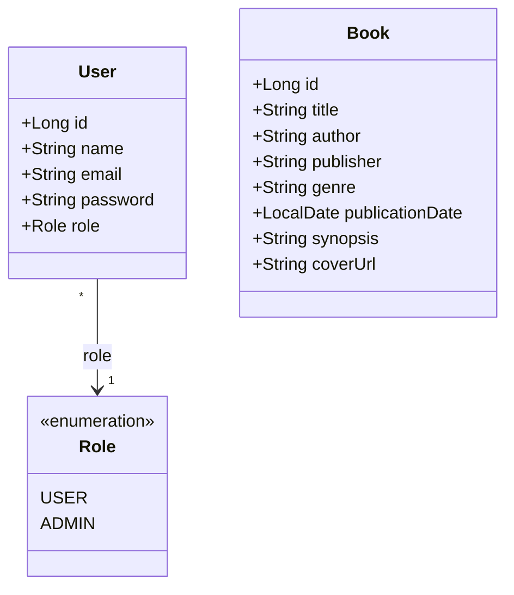

# Xopxe — Camadas da Arquitetura

## 1. Visão geral

O Xopxe é um site de acervo de livros. Ele é dividido em duas aplicações
separadas:

| Parte | Tecnologia | Porta |
|---|---|---|
| `backend/` | Java 25 + Spring Boot 4.1 | 8080 |
| `frontend/` | React 19 + Vite | 5173 |
| banco | PostgreSQL 17 | 5432 |

## 2. Camadas do back-end

O código é separado por funcionalidade (`book`, `user`, `auth`), e dentro de
cada pacote ficam as classes das camadas.

```
backend/src/main/
├── java/br/com/dominadores/xopxe/
│   ├── XopxeApplication.java     classe principal
│   ├── book/
│   │   ├── Book.java             entidade JPA
│   │   ├── BookRepository.java   repositório
│   │   ├── BookService.java      regras de negócio
│   │   ├── BookController.java   rotas HTTP
│   │   └── BookDtos.java         dados que entram e saem da API
│   ├── user/
│   │   ├── User.java             entidade JPA
│   │   ├── Role.java             enum USER / ADMIN
│   │   ├── UserRepository.java   repositório
│   │   └── DatabaseUserDetailsService.java
│   ├── auth/
│   │   ├── AuthController.java   login e cadastro
│   │   └── AuthDtos.java
│   └── config/
│       ├── SecurityConfig.java   permissões, CORS e senha
│       ├── ApiExceptionHandler.java
│       └── DemoUsersSeeder.java  usuários de teste
└── resources/
    ├── application.yaml
    └── db/migration/             scripts do Flyway que criam as tabelas
```

### Entidades (JPA)

`Book` e `User` são as classes anotadas com `@Entity`. Cada uma representa uma
tabela do banco.

```java
@Entity
@Table(name = "books")
public class Book {
    @Id @GeneratedValue(strategy = GenerationType.IDENTITY)
    private Long id;

    @Column(nullable = false)
    private String title;
    // ...
}
```

Quem cria as tabelas é o Flyway, com os scripts SQL em `db/migration/`. O
Hibernate está configurado com `ddl-auto: validate`, ou seja, ele só confere se
as entidades batem com o banco e não altera nada.

### DTOs

São os `record`s de `AuthDtos` e `BookDtos`. Servem para separar o que trafega
na API do que está no banco.

Os de entrada são validados com `@NotBlank`, `@Email` e `@Size`. Os de saída
são montados a partir da entidade por um método `from(...)`. O `UserResponse`,
por exemplo, não tem o campo de senha, então a senha nunca vai para o front.

### Repositórios

São interfaces que estendem `JpaRepository`. O Spring Data cria a consulta a
partir do nome do método.

```java
public interface UserRepository extends JpaRepository<User, Long> {
    Optional<User> findByEmail(String email);
    boolean existsByEmail(String email);
}
```

Métodos como `save`, `findById` e `findAll` já vêm prontos.

### Serviços

Ficam entre o controlador e o repositório e guardam as regras de negócio. O
`BookService` ainda não foi implementado: os métodos lançam
`UnsupportedOperationException`, então as rotas de livro respondem erro 500. O
catálogo da tela ainda usa dados mockados.

### Controladores

São as classes `@RestController` com as rotas:

| Método | Rota | Acesso |
|---|---|---|
| POST | `/api/auth/register` | público |
| POST | `/api/auth/login` | público |
| GET | `/api/books` | público |
| GET | `/api/books/{id}` | público |
| POST | `/api/books` | ADMIN |

### Configuração

`SecurityConfig` define quem acessa o quê, libera o endereço do front no CORS e
registra o `BCryptPasswordEncoder`, usado para gravar a senha com hash.

`ApiExceptionHandler` transforma os erros em um JSON simples com a mensagem, e
`DatabaseUserDetailsService` ensina o Spring Security a buscar o usuário na
nossa tabela.

## 3. Camadas do front-end

```
frontend/src/
├── main.jsx        inicia o React e carrega o CSS global
├── App.jsx         troca de página
├── pages/          telas inteiras: MainPage e BookRegistration
├── components/     peças da tela (Header, SearchBar, Filters, BooksCatalog,
│                   BooksInfo, DefaultInfo, BookForm, AccountMenu)
├── api/            chamadas ao back-end (auth.js)
├── data/           dados de exemplo
├── styles/         todo o CSS
└── assets/         imagens
```

Cada componente tem um arquivo de CSS com o mesmo nome em `styles/`, importado
por ele. Os arquivos globais (`tokens.css` com as cores e fontes, `base.css`
com o reset e `panel.css`) são carregados no `main.jsx`. As classes seguem o
padrão BEM, como `.book-card__title`.

O estado fica no componente pai que precisa dele e desce por props. O `App`
guarda a página atual e o usuário logado; a `MainPage` guarda a busca, os
filtros e o livro selecionado.

## 4. Diagrama de classes

As duas entidades do banco e o enum do papel do usuário.



`User` vira a tabela `users`, com o e-mail único e a senha gravada em hash.
`Book` vira a tabela `books`, onde só a capa é opcional. As duas ainda não se
relacionam, porque a tabela de avaliações não existe.

## 5. Como rodar

```bash
./dev.sh          # sobe banco, back-end e front-end
./dev.sh --stop   # para o banco
```

O site abre em `http://localhost:5173` e a API em `http://localhost:8080`.
Precisa de Java 25 e do Docker ou Podman instalados.
